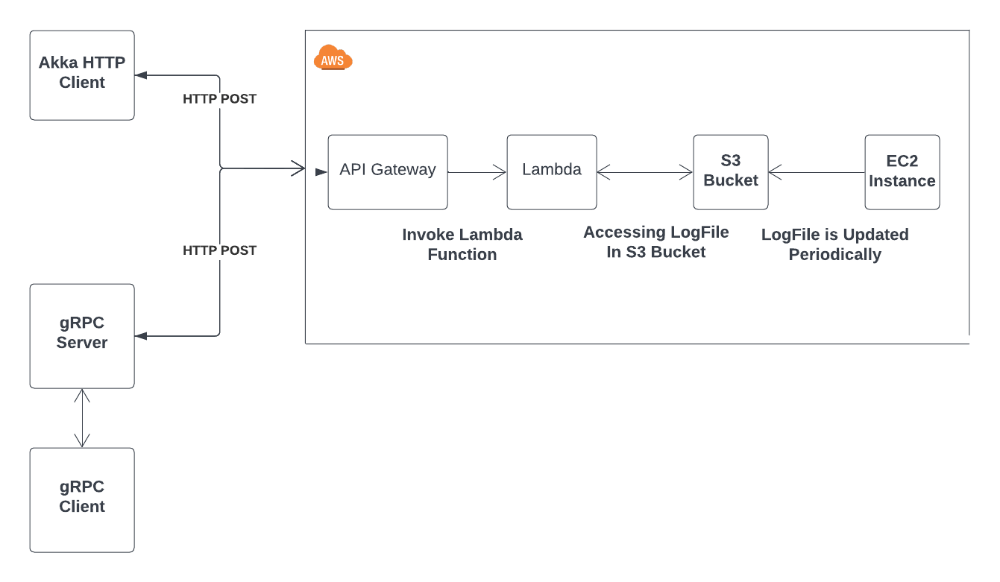
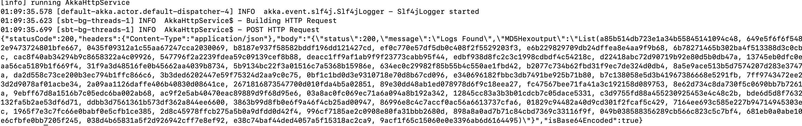
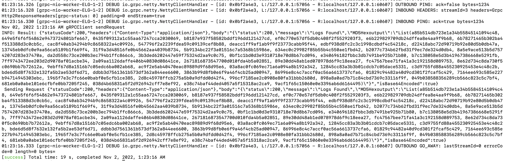
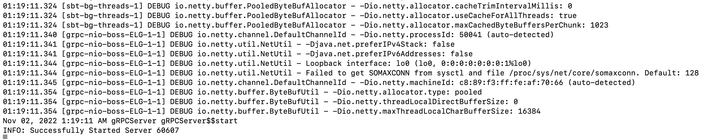
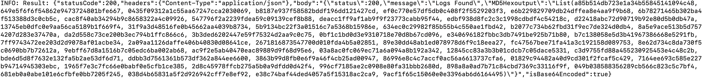

# AWS Services
## Homework 2

### Srikanth Kyatham [UIN - 663943205]


### Environment:
**OS** : Mac OS

### PreRequisites:
- SBT
- Java 11
- Scala 2.13
- AWS CLI

### Homework Problem :
LogFileGenerator : https://github.com/0x1DOCD00D/CS441_Fall2022/blob/main/Homeworks/Homework2.md

### Design and Implementation :



### Sub Projects :
This Repository contains multiple subprojects which can be build and run separately .
1. **AkkaHttpService**
2. **GRPC**  
3. **LambdaFunction** 


### AkkaHttpService

Implementation a RESTful service for retrieving log messages

Steps to run the project.
1. Clone the repository .
2. Change Directory to the AWSLambdaFunction/AkkaHttpService root directory in terminal/command prompt.
3. Run below command to build project .
    ```
    sbt clean compile
    ```
4. Please use below command to run Project.
    ```
    sbt clean run
    ```
5. Below is the Output.

    
    ---

### GRPC

Client Server Implementation that uses gRPC to invoke a lambda function

Steps to run the project.
1. Clone the repository .
2. Change Directory to the AWSLambdaFunction/GRPC root directory in terminal/command prompt.
3. Run below command to build project .
    ```
    sbt clean compile
    ```
4. Please use below command to run Project.
    ```
    sbt clean run
    ```
5. Choose gRPCServer which will start the server which listens to requests on port 60607(Customisable) 

    

6. Once Server is Up and Running . Open new terminal and do run again sbt clean run to invoke client program which will make call to grpcserver .

    

### LambdaFunction
Function Contains algorithm which checks for TimeStamp in O(LogN) and returns MD5-generated hash code from the messages which have designated pattern in given time interval.

**Functionality**:
1. First will do Binary Search (uses Buffer Reader to go mid-point) to check if given time stamp exits .
2. If Time Stamp found will return  Status 200 and List of all MD5-generated hash code of logs in given interval which contain designated pattern
3. If Time Stamp not Found will return Status 400 with message that says logs not found .

**Success Output**:

  

**Failed Output**:

  

Steps to generate Jar to Deploy to AWS : 
1. Clone the repository .
2. Change Directory to the AWSLambdaFunction/AkkaHttpService root directory in terminal/command prompt.
3. Run below command to build project .
    ```
    sbt clean compile
    ```
4. Use below command to generate assembly jar. 
    ```
    sbt assembly
    ```
5. Jar will be generated in target/scala-2.13/ folder which can deployed to AWS Lambda function.


## Deploying LogFileGenerator in EC2 Instance.

### LogFileGenerator code
 Repository: https://github.com/kyathamsrikanth/CS441_Fall2022/tree/main/LogFileGenerator

LogFileGenerator will be triggered periodically using cronjob in ec2 instance . 
So LogFileGenerator will update the logs periodically and log file is moved to designated S3 Bucket .

Cronjob script : [cronJob.sh](cronJob.sh)

Steps to deploy  and run LogFileGenerator on EC2 Instance :
1. Create a EC2 Instance
2. SSH into EC2 Instance using below command :
    ```
    ssh -i "<pem_file>" ec2-user@<EC2_Adress>.compute-1.amazonaws.com
    ```
3. Copy all dependencies to EC2 Instance using below command :
    ```
    scp -i <pem_file> <dependencies_local_Path>/* ec2-user@<EC2_Adress>.compute-1.amazonaws.com:<EC2_directoryPath>
    ```
4. Install Java 11 using below command :
    ```
    sudo amazon-linux-extras install java-openjdk11 
    ```
5. Install AWS CLI
    ```
    curl "https://awscli.amazonaws.com/awscli-exe-linux-x86_64.zip" -o "awscliv2.zip"
    unzip awscliv2.zip
    sudo ./aws/install
    ```
6. Upload cronJob.sh to Ec2 Instance and use below command to configure Job to run Periodically: 
    ```
    cronjob -e
    ```


